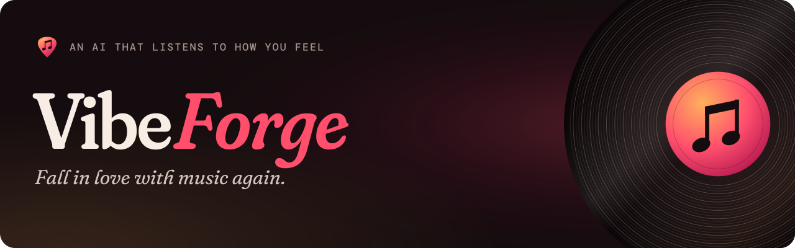
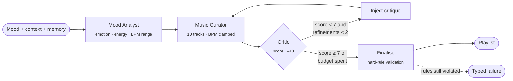
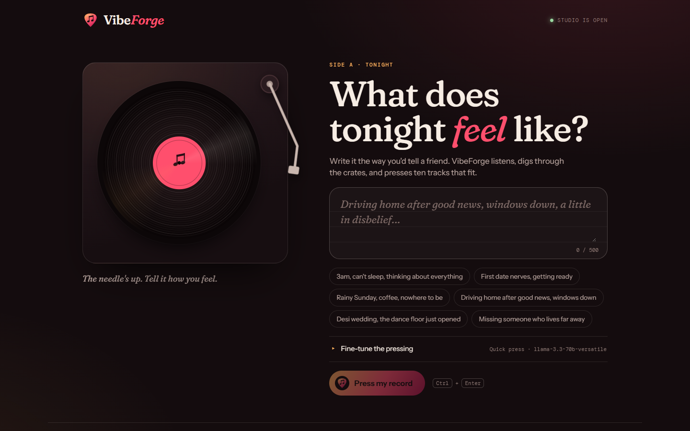

<p align="center">
  
</p>

<p align="center">
  <a href="https://github.com/niravpatidar37/vibeforge/actions/workflows/ci.yml"></a>
  <a href="https://www.python.org/"></a>
  <a href="https://langchain-ai.github.io/langgraph/"></a>
  <a href="https://fastapi.tiangolo.com/"></a>
  <a href="https://react.dev/"></a>
  <a href="https://github.com/astral-sh/uv"></a>
  <a href="LICENSE"></a>
</p>

<p align="center">
  <b>Describe the moment. Get a playlist that fits it.</b><br>
  VibeForge is an agentic playlist generator: a mood analyst, a curator, and a critic
  work through a LangGraph state machine to turn plain language into ten well-balanced tracks.
</p>

<p align="center">
  <a href="#-quick-start">Quick start</a> ·
  <a href="#-how-it-works">How it works</a> ·
  <a href="#-web-app">Web app</a> ·
  <a href="#-http-api">HTTP API</a> ·
  <a href="#-configuration">Configuration</a> ·
  <a href="#-security-model">Security</a>
</p>

---

## ✦ What it does

```text
$ vibeforge --mood "late night lo-fi study session" --agentic

  Mood Analyst  →  Music Curator  →  Critic (8/10 ✓)  →  Finalise

╭──────────────────────────── VibeForge ─────────────────────────────╮
│  Late Night Focus                                                   │
│  Relaxing and concentrated atmosphere for a late night study session│
╰─────────────────────────────────────────────────────────────────────╯
  #lo-fi  #chill  #study

╭────┬─────────────────────────┬──────────────────┬───────────┬───────┬─────────────╮
│ #  │ Title                   │ Artist           │ Genre     │ BPM   │ Links       │
├────┼─────────────────────────┼──────────────────┼───────────┼───────┼─────────────┤
│ 1  │ Rainy Night             │ Jinsang          │ lo-fi     │ 90    │ Spotify  YT │
│ 2  │ Aruarian Dance          │ Nujabes          │ lo-fi     │ 95    │ Spotify  YT │
│ 3  │ Weightless              │ Marconi Union    │ ambient   │ 50    │ Spotify  YT │
│ …  │ …                       │ …                │ …         │ …     │ …           │
╰────┴─────────────────────────┴──────────────────┴───────────┴───────┴─────────────╯

  Genres: lo-fi hip hop, electronic, instrumental   Energy: LOW
```

<sub>Example output. Track picks are model-generated and vary between runs.</sub>

| | |
|---|---|
| 🎧 **Natural-language moods** | Any feeling, activity, or scene: *"3am can't sleep"*, *"desi wedding vibes"*, *"post-workout cool down"* |
| 🎚️ **Ten tracks, every time** | Title, artist, genre, and BPM, with Spotify and YouTube links |
| 🧠 **Three generation modes** | Fast (single call) · Deep (analyst → curator) · Agentic (LangGraph with a self-correcting critic) |
| ✅ **Hard output contract** | Every mode validates track count, artist and genre diversity, duplicates, and BPM bounds before returning |
| 🌦️ **Context-aware** | Time of day, optional live weather, an optional seed track as a vibe anchor |
| 💾 **Taste memory** | Per-track feedback shapes future playlists and skips recently heard tracks |
| 🌍 **Multilingual taste** | Bollywood, K-pop, Latin, Afrobeats, and more |
| 🔌 **Provider-flexible** | Groq by default, hosted Hugging Face Inference Providers via `hf:` model IDs |
| 🔭 **Observable** | Opt-in LangSmith tracing for every stage, model call, retry, and validation failure |

---

## ⚡ Quick start

**Prerequisites:** Python 3.11+, [uv](https://github.com/astral-sh/uv), and a free [Groq API key](https://console.groq.com) (or a Hugging Face token).

```bash
git clone https://github.com/niravpatidar37/vibeforge.git
cd vibeforge
uv sync

cp .env.example .env          # then set GROQ_API_KEY (or HF_TOKEN)

uv run vibeforge --mood "sunny highway road trip, windows down"
```

### CLI usage

```bash
uv run vibeforge --mood "rainy day jazz, working from home"            # fast
uv run vibeforge --mood "heartbreak, raining outside" --deep           # two-stage
uv run vibeforge --mood "heartbreak, raining outside" --agentic        # LangGraph + critic
uv run vibeforge --mood "gym" --seed "Blinding Lights by The Weeknd"   # seed track anchor
uv run vibeforge                                                       # interactive loop, 'quit' to exit
```

| Option | Description |
|---|---|
| `--mood`, `-m` | Mood or activity description (skips the prompt) |
| `--context`, `-c` | Extra context, e.g. `"rainy day, studying"` |
| `--seed`, `-s` | Seed track used as a vibe anchor |
| `--deep` | Two-stage mode: Mood Analyst → Music Curator |
| `--agentic` | LangGraph mode: Analyst → Curator → Critic → refine → Finalise |
| `--model` | Model override (default `llama-3.3-70b-versatile`) |
| `--no-spotify` | Skip Spotify link enrichment |
| `--no-feedback` | Skip the post-playlist feedback prompt |

---

## 🧭 How it works

| Mode | Flag | Pipeline | Typical use |
|---|---|---|---|
| **Fast** | *(default)* | Context + memory → LLM → validated playlist | Quick, one-call results |
| **Deep** | `--deep` | Mood Analyst → Music Curator | Better mood decomposition |
| **Agentic** | `--agentic` | LangGraph state machine with a critic loop | Highest quality, self-correcting |

### Agentic mode



- **Shared typed state.** `AgentState` (mood input, context, memory, mood analysis, playlist, critique) flows through every node.
- **Autonomous routing.** The graph decides whether to refine or accept from the critic's score (`ACCEPT_SCORE = 7`, `MAX_REFINEMENTS = 2`).
- **Specialised roles.** Analyst at temperature 0.7, curator 0.8, critic 0.3 for consistent scoring.
- **Fail closed.** If a playlist still breaks the hard rules after the refinement budget, finalisation raises instead of publishing it.
- **After the graph.** Spotify enrichment runs in parallel (5 threads), and the session is saved to local memory.

Everything is wrapped by one **application service** (`application.py`) shared by the CLI and the API, so mode selection, validation, caching (in-process, or Redis when `REDIS_URL` is set, 15-minute TTL), and feedback-driven cache invalidation behave identically everywhere. See [`docs/system-design.md`](docs/system-design.md) for boundaries and the production target architecture.

---

## 🖥️ Web app

<p align="center">
  
</p>

The React + Vite UI in [`vibeforge-ui/`](vibeforge-ui/) is built like a record shop:

- **Write a feeling.** A letter-style prompt with starter moods; Ctrl + Enter presses the record.
- **The turntable.** The record spins at 33⅓ rpm while VibeForge works, and the tonearm drops in. In Studio session (agentic) mode, each LangGraph step streams in live: the mood read, curation takes, and the critic's score.
- **A sleeve for every playlist.** Each result gets generated cover art (palette picked from the playlist, sun height set by its energy), with the record sliding out of the sleeve.
- **Side A / Side B.** Ten tracks split like an LP. Each track has a dot that pulses at its BPM, Spotify and YouTube links, and ♥ / ✕ buttons that teach your taste memory.

```bash
# Terminal 1: API
uv run uvicorn api:app --reload --port 8000

# Terminal 2: UI
cd vibeforge-ui
npm install
npm run dev        # → http://localhost:5173
```

Set `VITE_API_BASE` at build time if the API isn't on `http://localhost:8000`. Fonts are self-hosted from npm (`@fontsource`), so the UI makes no third-party requests; only the track links you click leave the app.

It supports all three modes, live LangGraph progress over Server-Sent Events, model selection (including `hf:` models), Spotify enrichment, and per-track feedback.

---

## 🔗 HTTP API

| Method | Path | Purpose |
|---|---|---|
| `GET` | `/healthz` | Liveness check |
| `GET` | `/models` | Allowed model IDs |
| `POST` | `/generate` | Generate a playlist (`mood`, `context`, `seed`, `model`, `mode`, `spotify_enrich`) |
| `GET` | `/stream` | Agentic generation as SSE, one event per graph node, then `done` |
| `POST` | `/enrich` | Resolve Spotify links for a playlist |
| `POST` | `/feedback` | Save loved and disliked tracks to taste memory |

Inputs are length-capped by Pydantic (`mood` ≤ 500 chars, `context` ≤ 500, `seed` ≤ 200), and provider errors are sanitised before they reach the client.

---

## ⚙️ Configuration

Copy [`.env.example`](.env.example) to `.env`.

| Variable | Required | Purpose |
|---|---|---|
| `GROQ_API_KEY` | Yes, for Groq models | LLM access ([console.groq.com](https://console.groq.com)) |
| `HF_TOKEN` | For `hf:` models | Hugging Face Inference Providers |
| `HF_API_URL` | No | Override the Hugging Face router endpoint |
| `SPOTIFY_CLIENT_ID` / `SPOTIFY_CLIENT_SECRET` | No | Direct Spotify track URLs (falls back to search links) |
| `OPENWEATHER_API_KEY` / `OPENWEATHER_CITY` | No | Weather-aware recommendations |
| `REDIS_URL` | No | Generation cache shared across API workers |
| `VIBEFORGE_CORS_ORIGINS` | No | Comma-separated allowed browser origins |
| `VIBEFORGE_DATA_DIR` | No | Where taste memory is stored (default `~/.vibeforge/`) |
| `LANGCHAIN_TRACING_V2`, `LANGCHAIN_API_KEY`, `LANGCHAIN_PROJECT` | No | LangSmith tracing |

### Models

| Model ID | Provider |
|---|---|
| `llama-3.3-70b-versatile` *(default)* | Groq |
| `llama-3.1-8b-instant` | Groq |
| `gemma2-9b-it` | Groq |
| `hf:Qwen/Qwen2.5-72B-Instruct` | Hugging Face router |
| `hf:meta-llama/Llama-3.1-8B-Instruct` | Hugging Face router |

> [!NOTE]
> Provider catalogues change. If a model is decommissioned, update `AVAILABLE_MODELS` in `src/vibeforge/utils.py`.

### Observability

Set `LANGCHAIN_TRACING_V2=true` with a LangSmith key to trace the application service, the LangGraph workflow, model calls, and the Hugging Face adapter: stage latency, retries, validation failures, refinement count, and provider errors. Objective playlist checks are exposed as `vibeforge.quality.playlist_rule_evaluator` for LangSmith evaluations. Don't put provider tokens or raw taste memory into trace metadata.

---

## 🛡️ Security model

VibeForge is built for **local, single-user use**. Know what that means before you deploy it:

- **No authentication or rate limiting.** Don't expose `api.py` to the internet as is. Put it behind an authenticating gateway with per-user rate limits and spend caps first.
- **Model output is untrusted.** Playlists are schema-validated and checked against hard rules in code, never by the model alone. Track links are rendered as plain anchors; treat them as untrusted links.
- **Your inputs reach the model.** Mood, context, seed, and weather text go into prompts. Don't paste secrets into them.
- **Secrets stay server-side.** API keys are read from the environment and never sent to the browser.
- **Taste memory is a local file** (`~/.vibeforge/memory.json`). It isn't safe for multi-process or multi-user deployments. See [`docs/system-design.md`](docs/system-design.md) for the Postgres-backed target.

Found a vulnerability? Please report it privately through [GitHub security advisories](https://github.com/niravpatidar37/vibeforge/security/advisories/new), not a public issue.

---

## 🧪 Tests

```bash
uv run pytest tests/test_models.py tests/test_quality.py tests/test_graph_agent.py tests/test_application.py -v   # offline
uv run pytest tests/ -v                                                                                           # + live tests (needs GROQ_API_KEY)
```

---

## 🗂️ Project structure

```text
vibeforge/
├── src/vibeforge/
│   ├── main.py            # Typer CLI (--mood, --deep, --agentic)
│   ├── application.py     # Shared generation service: validation, caching, mode selection
│   ├── playlist_agent.py  # Fast mode: single LangChain call
│   ├── crew_agent.py      # Deep mode: analyst → curator
│   ├── graph_agent.py     # Agentic mode: LangGraph state machine + critic loop
│   ├── quality.py         # Deterministic playlist validators + LangSmith evaluator
│   ├── models.py          # Pydantic schemas: Track, Playlist, MoodAnalysis
│   ├── context.py         # Time-of-day + live weather context
│   ├── memory.py          # Taste memory (favourites, freshness, compaction)
│   ├── spotify.py         # Spotify enrichment (parallel)
│   ├── utils.py           # Model registry, token budgeting, HF adapter, prompts
│   └── display.py         # Rich terminal UI
├── api.py                 # FastAPI HTTP + SSE adapter
├── vibeforge-ui/          # React + Vite frontend
├── tests/                 # Offline unit tests + live integration tests
├── docs/
│   ├── system-design.md   # Current and production-target architecture
│   ├── ui-preview.png
│   └── brand/             # Logo, banner, social preview
└── pyproject.toml
```


---

## 🎨 Brand assets

| Asset | File |
|---|---|
| App mark (pick on a dark tile) | [`docs/brand/logo-mark.svg`](docs/brand/logo-mark.svg) · [`512 px PNG`](docs/brand/logo-mark-512.png) |
| Pick only, no tile | [`docs/brand/logo-pick.svg`](docs/brand/logo-pick.svg) |
| Horizontal logo, dark backgrounds | [`docs/brand/logo-horizontal-light.svg`](docs/brand/logo-horizontal-light.svg) |
| Horizontal logo, light backgrounds | [`docs/brand/logo-horizontal-dark.svg`](docs/brand/logo-horizontal-dark.svg) |
| README banner | [`docs/brand/banner.svg`](docs/brand/banner.svg) |
| Social preview (1280×640) | [`docs/brand/social-preview.png`](docs/brand/social-preview.png) |
| Square app icon (full-bleed, for `apple-touch-icon`) | [`docs/brand/app-icon-square.svg`](docs/brand/app-icon-square.svg) |

The mark is a guitar pick whose point doubles as the V, with two beamed eighth notes cut into it.

Palette ("ember"): ink `#140c0e` · cream `#f7ede4` · amber `#ffb05c` · rose `#ff4f6d` · wine `#b3174f`. Type: Fraunces (soft, with an italic "Forge"), Instrument Sans, and DM Mono, all SIL OFL. Text in the SVGs is converted to outlines, so the files render the same everywhere without the fonts installed. To regenerate them:

```bash
cd docs/brand/source
# fonts are downloaded on demand (see the build_brand.py docstring); they aren't committed
uv run --no-project --with fonttools --with uharfbuzz python build_brand.py ../
uv run --no-project --with pillow python render_png.py   # PNG exports via headless Edge/Chromium
```

---

## 🤝 Contributing

Contributions are welcome. Start with [CONTRIBUTING.md](CONTRIBUTING.md).

## 📄 License

[MIT](LICENSE)
